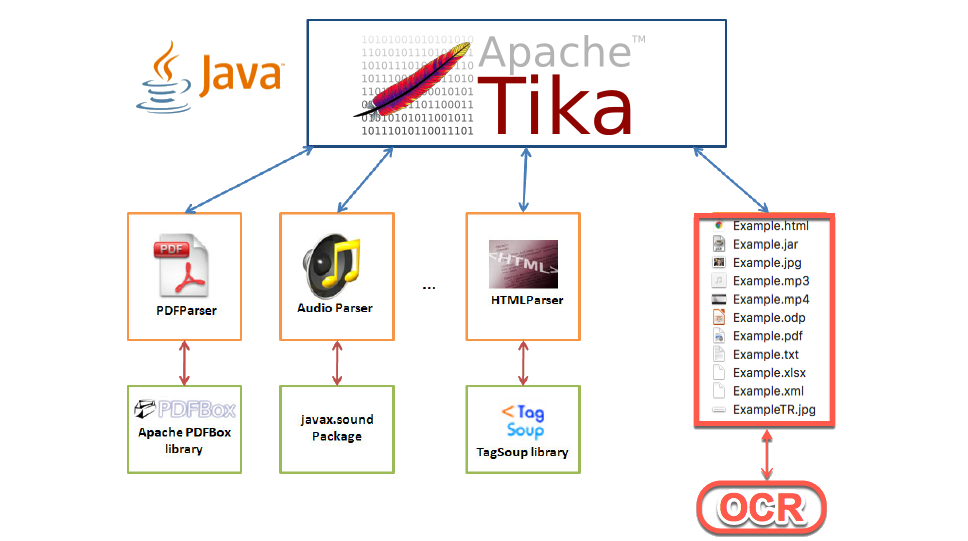

# Apache Tika OCR Demo Java Project
Apache Tika OCR Demo Java Project

Plus aspects:
Open source.
Text, PDF, JPEG, Html, Xml, Excel documents are doing text parse.

Text, PDF, JPEG, Html, Xml, Excel, Mp3, Odp, Mp4, JAR etc. Shows metadata information of files.

Negative aspects:
There are problems in Turkish characters.
